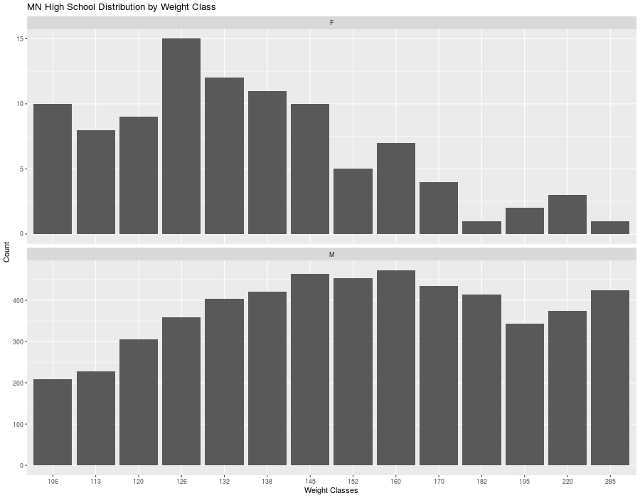

# MN High School Wrestling Weight Classes
Data and charts from the 2019-2020 season for every school (sourced from TrackWrestling.com)

## Distribution of Weight Classes
This chart shows the distribution across all weight classes for grades 9th - 12th. I split out Girls and Boys to show where the concentration of wrestlers are within the weights. NOTE: The y-scales are not equal, if they were, the numbers of the girls data is dwarfed by the boys so you can't see the distribution. If I combine these two, the girls numbers are not big enought to significantly impact the boys curve. When MSHSL approves girls wrestling, it will be important to look at the data independently.

