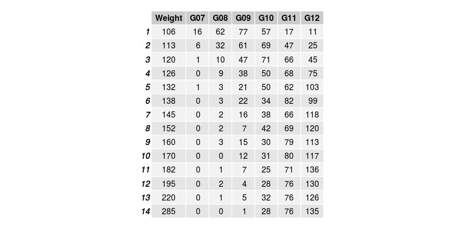

# MN High School Wrestling Weight Classes
Data and charts from the 2019-2020 season for every school (sourced from TrackWrestling.com)

## Distribution of Weight Classes

This chart shows the distribution across all weight classes for grades 9th - 12th. This bar chart is sorted by most to least:

If you break out each grade, you can see the Freshman class skews heavily to the lighter side while Sophmores on up skew to the heavier side.

## State Tournament Participation by Grade and Weight Class
Looking at the state tournament participation, the participation in the middle and upper weights is dominated by upper classman.

The following table was sourced from TStuff.com from 2016-2020 for all three classes:

I left the girls in the data, they did not have the numbers to significantly alter the shape of the curves. When the MSHSL approves girls wrestling, they should be looked at independently.

If you have any questions about this data, please contact me at darrin.homme@gmail.com
